# **Welcome to my Lab Report 1 Page !**


## Lab 1: Remote Access & the File System
------
### 1. Installing VScode
I already had VScode installed. However if you do not you can go to the following site to download it [VScode](https://code.visualstudio.com/)

  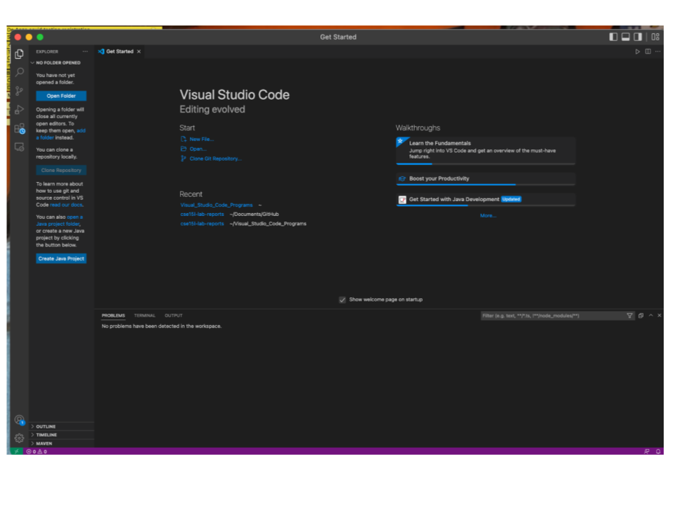

### 2. Remotely Connecting
* Once in your terminal type the following command: 

  ```
  ssh cs15lfa22op@ieng6.ucsd.edu
  ```

* The last 2 letters in cs15lfa22op are unique to your own username

* If you have issues logging in like me :'(  -> use your triton account instead such as: 

  ```
  ssh m1gill@ieng6.ucsd.edu
  ```
  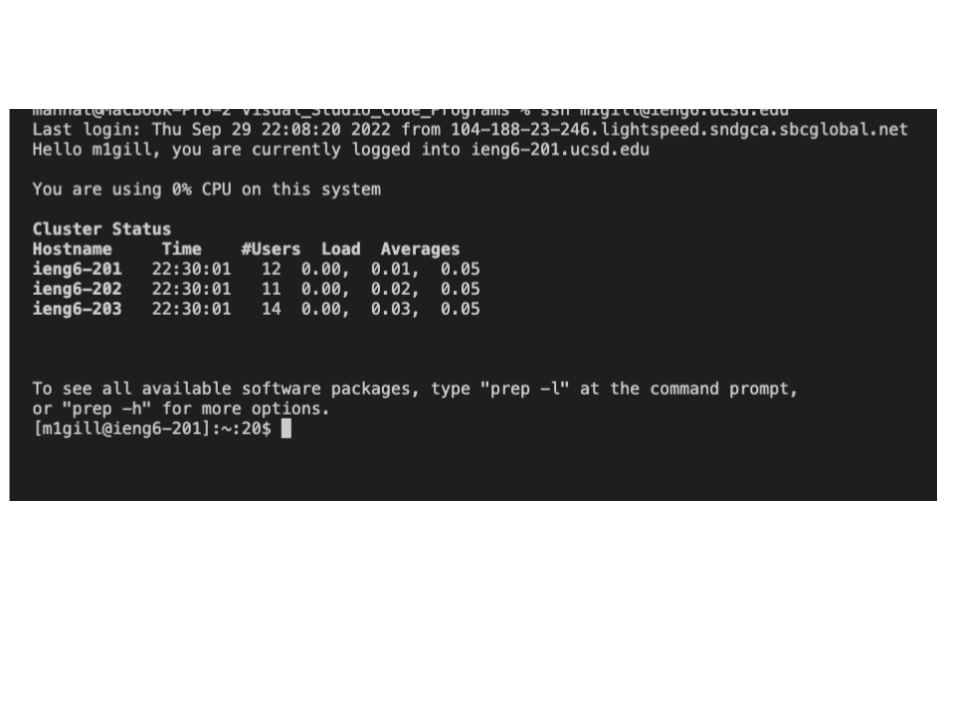
### 3. Trying Some Commands
Running commands cd, ls, pwd, mkdir, cp 

1. First used ls to list the files in the directory: 

    ```
    $ ls
    ```

2. Then used cd to change the directory: 

    ```
    $ cd perl5
    ```

3. Third used pwd to print the working directory: 

    ```
    $ pwd
    ```

4. Then printed hidden files: 

    ```
    $ ls -a
    ```

5. To display a help message for mkdir(make director): 

    ```
    $ mkdir --help
    ```

6. Printed the contents of the file hello.txt: 

    ```
    $ cat /home/linux/ieng6/cs15lfa22/public/hello.txt
    ```

   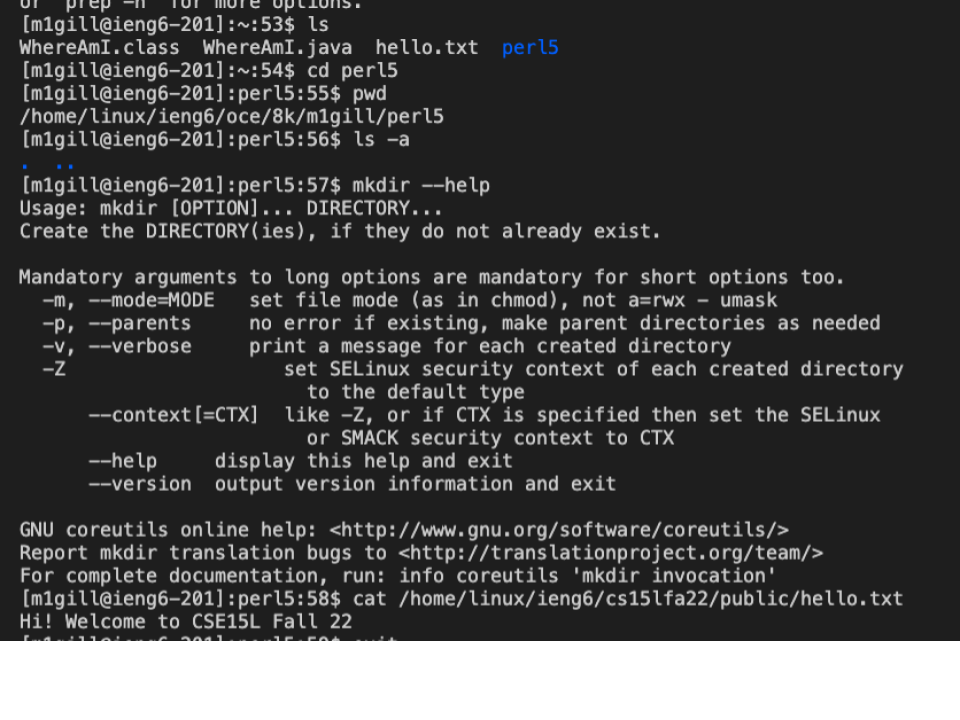

### 4. Moving Files with scp
In order to copy from your computer to the remote server
1. Logout of the remote server
2. Make sure the file you want to move over is already created 
3. Test this by using the following commands (If you have an issue it could be you are in the wrong directory)
```
javac WhereAmI.java

java WhereAmI
```
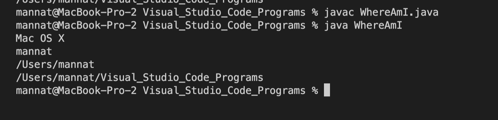 
4. Then run the following command to copy it over to you remote server: 
  ```
  scp WhereAmI.java m1gill@ieng6.ucsd.edu:~/
  ```
  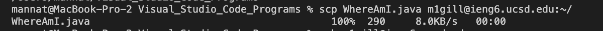
5. Make sure you change WhereAmI.java to whatever file you are copying over
6. Then log into your remote server to check if the file copied over 
  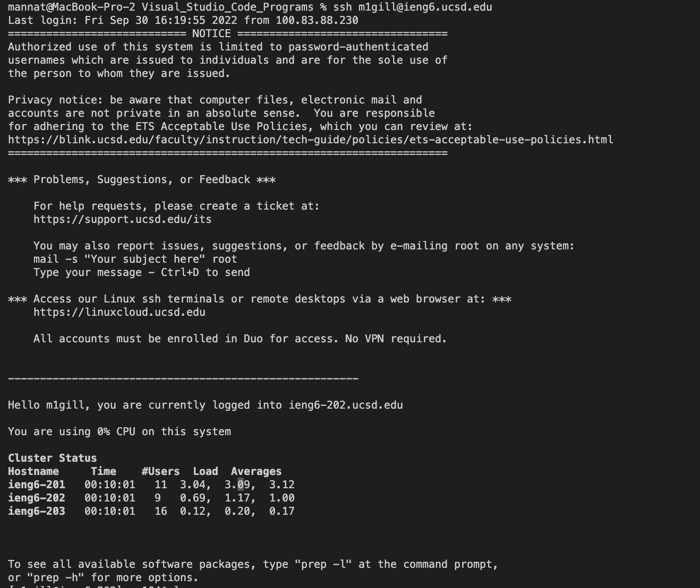
7. Type in the command this command to see all the files in your directory and you 
should see the file name appear 

    ```
    $ ls
    ```
8. You can then run the program using the following commands again to run the program within the file
  ```
  javac WhereAmI.java

  java WhereAmI
  ```
  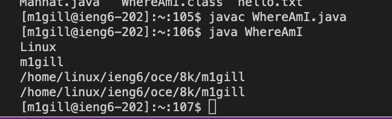

#### Output differences on local and remote
* Looking at the images above, when the following commands were run 

```
javac WhereAmI.java

java WhereAmI
```

on both the local and remote. The differences are what the program outputed. Looking at the code for WhereAmI.java which is:

```
class WhereAmI {public static void main(String[] args) {
    System.out.println(System.getProperty("os.name"));

    System.out.println(System.getProperty("user.name"));

    System.out.println(System.getProperty("user.home"));

    System.out.println(System.getProperty("user.dir"));
  }
}  
```

it is supposed to print information about the operating system (os), username, user directory and the user working directory. 
* The reason why we see different outputs is because the first time we ran it we were on our local server, therefore the os, name, directory, and working directory are local. However when we ran it on the remote server, its prints out information relating to that server, since we are running it on a different location. 

### 5. Setting an SSH Key
Purpose of this step is creating a two files referred to as the public key and private key. The public key gets saved on the server while the private key gets saved on the client. This will allow us to get on the remote server without entering a password

Do only if it hasn't been set up before 
1. Type in the command: 

    ```
    $ ssh-keygen
    ```

2. When “Enter file in which to save the key (/Users/joe/.ssh/id_rsa):” appears just press Enter
3. Now when on the client type the command:

    ```
    ssh m1gill@ieng6.ucsd.edu
    ```

4. Then on the server type the command: 

    ```
    mkdir .ssh
    ```

5. Now on the client again: 

    ```
    scp /Users/mannat/.ssh/id_rsa.pub cs15lfa22@ieng6.ucsd.edu:~/.ssh/authorized_keys
    ```

6. Now, as the image shows below, you can login without entering your password 

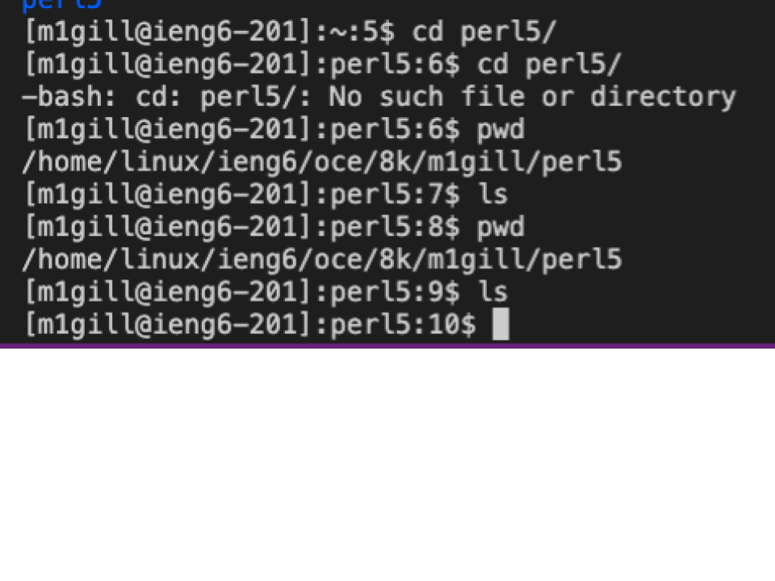

### 6. Optimizing Remote Running
Few tricks for optimizing remote running 
1. Writing a command in quotes at the end of an ssh command. Such as 
```
$ ssh m1gill@ieng6.ucsd.edu "ls"
```
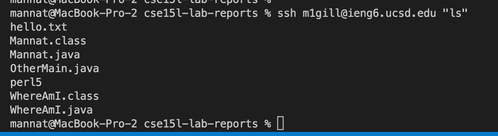 
2. Use semicolons to run multiple commands in one line 

```
$ cp WhereAmI.java OtherMain.java; javac OtherMain.java; java WhereAmI
```

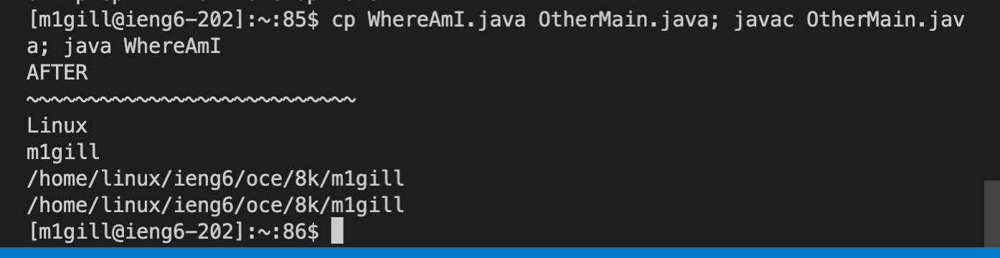

Below is an example of the output of WhereAmI.java before it was altered. 
Then I manually edited the file to print something else. I used optimized remote running by combining commands to update WhereAmI.java on the remove server and run it to print the new output. 

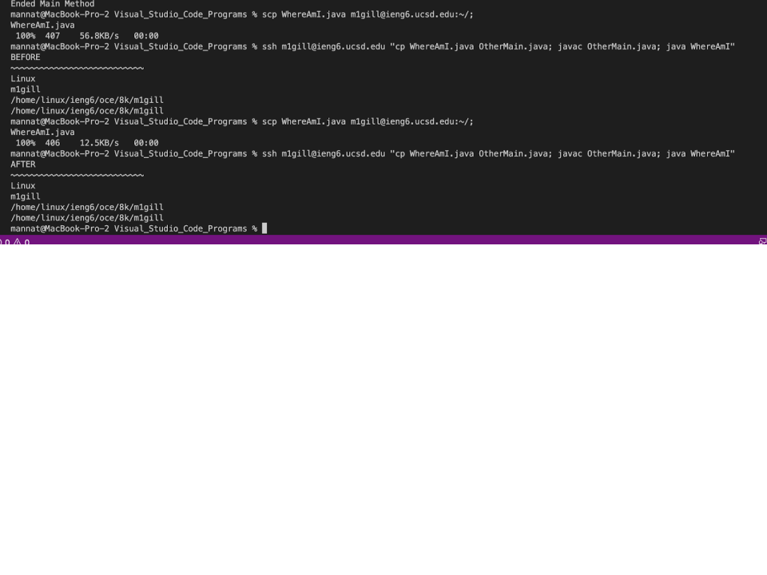


