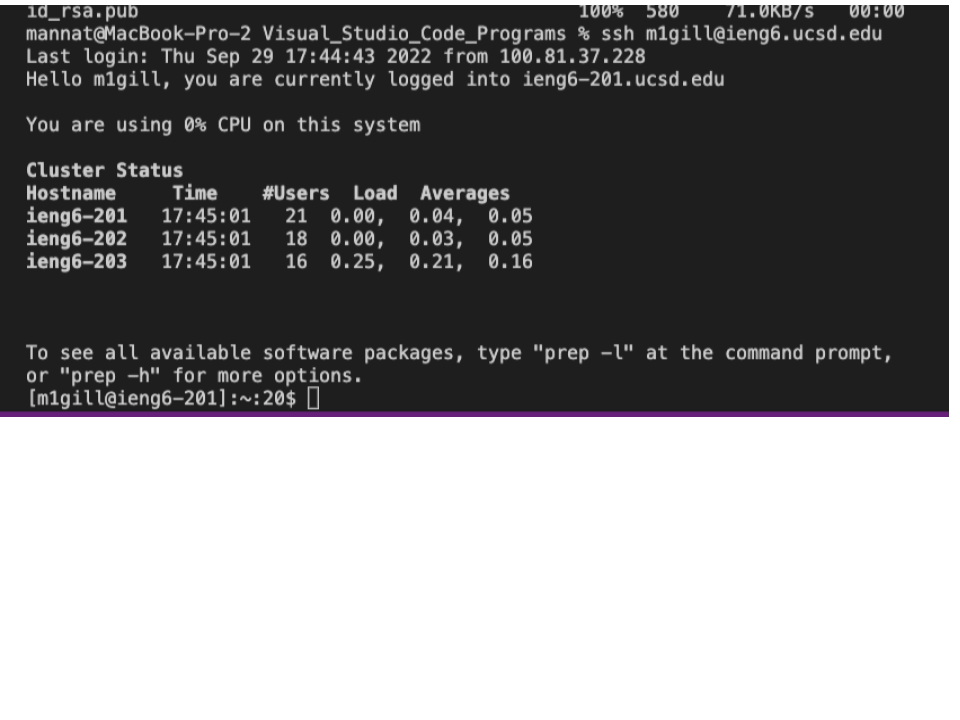

# **Welcome to my Lab Report Page !**

## Lab 1 :Remote Access & the File System
------
### 1. Installing VScode

### 2. Remotely Connecting
>Once in your terminal type the following command ssh m1gill@ieng6.ucsd.edu

>(currently not logging in with using ssh username@ieng6.ucsd.edu because of password issue)

### 3. Trying Some Commands
>Running commands cd, ls, pwd, mkdir, cp 
1. First used ls to list the files in the directory: $ ls 
2. Then used cd to change the directory: $ cd perl5
3. Third used pwd to print the working directory: $ pwd
4. Then printed hidden files: $ ls -a
5. To display a help message for mkdir(make director): $ mkdir --help
6. Printed the contents of the file hello.txt: $ cat /home/linux/ieng6/cs15lfa22/public/hello.txt

### 4. Moving Files with scp
>In order to copy from your computer to the remote server
1. Logout of the remote server
2. Make sure the file you want to move over is already created 
3. Test this by using the following commands
>>javac name.java

>>java name

>>(If you have an issue it could be you are in the wrong directory)
4. Then run the following command to copy it over to you remote server: 
scp Mannat.java m1gill@ieng6.ucsd.edu:~/
5. Make sure you change Mannat.java to whatever file you are copying over
6. Then log into your remote server to check if the file copied over 
7. Type in the command ls to see all the files in your directory and you should see the file name appear 
8. You can then run the program using the following commands again to run the program within the file
>>javac name.java

>>java name

### 5. Setting an SSH Key

### 6. Optimizing Remote Running

