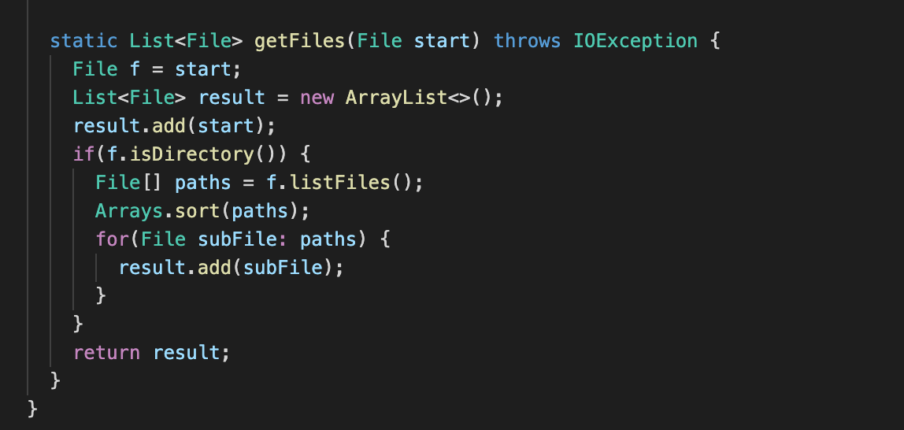

# **Welcome to my Lab Report 2 Page !**

# Lab 2 : Servers and Bugs 

## Part 1: Servers
## Part 2: Bugs 

### 1. 

Linked List: Append Method
--------------------------
FAILURE INDUCING INPUT : A linked list with elements {2, 3, 4}

SYMPTOM : Produced an infinite while loop, because n.next was being set to a new Node inside rather than outside the loop. --> Resulted in an error of "Java heap space"

BUG : Moved  "n.next = new Node(value, null);" from in inside the while loop to outside the while loop 

CHANGED : Method after making change

### 2. 

Files: GetFiles Method
--------------------------

FAILURE INDUCING INPUT : A list of file paths and a folder path

SYMPTOM : The expected order of the files in the list was different that tht order of the files outputed by the method. 

BUG : The method .listFiles() from the Files class does not put files in any particular order when adding them to an array. Therefore our expected outcome was different. To fix this I used the .sort method from the Arrays class to order the files alphabetically after they have been added to the array

CHANGED : Method after making change

