# **Welcome to my Lab Report 2 Page !**

# Lab 2 : Servers and Bugs 

## Part 1: Servers

SearchEngine Code
--------------------------
>

    import java.io.IOException;
    import java.net.URI
    class Handler implements URLHandler {
        String message = "Hello";

        public String handleRequest(URI url) {
            if (url.getPath().equals("/")) {
                return String.format(message);
            } else if (url.getPath().equals("/addSmiley")) {
                message += " there :) ";
                return String.format(message);
            } else if(url.getPath().equals("/remove")) {
                if(message.length()>5){
                    message = message.substring(0, 5); 
                }
                return String.format(message);
            }
            else {
                System.out.println("Path: " + url.getPath());
                if (url.getPath().contains("/addCheckup")) {
                    String[] parameters = url.getQuery().split("=");
                    if (parameters[0].equals("Name")) {
                        message += "\n" + parameters[1];
                        message += " hope you are doing well!";
                        return String.format(message);
                    }
                }
                return "Not Found!";
            }
        }
    }

    public class SearchEngine {
        public static void main(String[] args) throws IOException {
            if (args.length == 0) {
                System.out.println("Missing port number! Try any number between 1024 to 49151");
                return;
            }
            int port = Integer.parseInt(args[0]);
            Server.start(port, new Handler());
        }
    }

ScreenShot 1 : Opening Link
--------------------------
When you first run the SearchEngine.java class using this following command (shown in the picture) wth any value (in my case 4444). It will generate a link. 

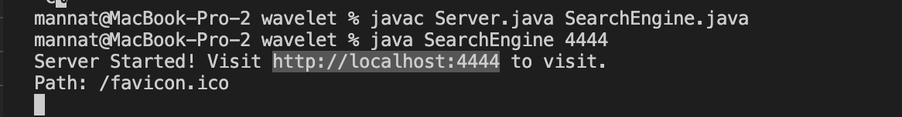

Opening the link will show you the following. When creating the link it calls on the method start from the Server class, passing in the integer value we entered along with a Handler object. When the Handler object is created it declares and initializes the string message to Hello. 

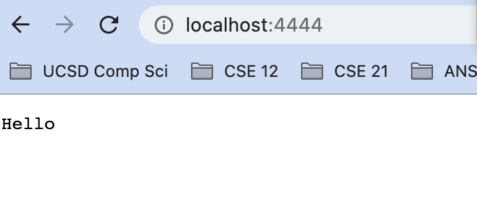

ScreenShot 2 : addSmiley
--------------------------
When you add the path "addSmiley", it goes into the method handleRequest and by going through the if statements, when the first if else statement comes back true for the path being "addSmiley", it adds " there :)" to the message. 

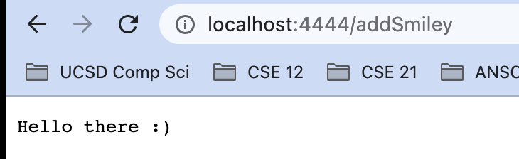

ScreenShot 3 : remove
--------------------------
When you add the path "remove", the else if statement comes back true for the path being "remove" and then changes the String message back to the original initilization of it being just "Hello"

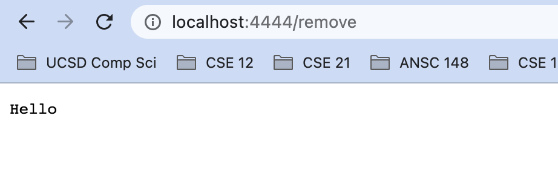

ScreenShot 4 : addCheckup
--------------------------
When you add the path "addCheckup" with the query "?Name=mannat" (I entered mannat but you could enter any string) the else if statement comes back true for the path being "addCheckup". It then checks the query and splits the query into an array of Strings, separating the string wherever it finds the = symbol. It then checks if the first element is "Name" and if it is, then it takes the second element and adds to the String message. 

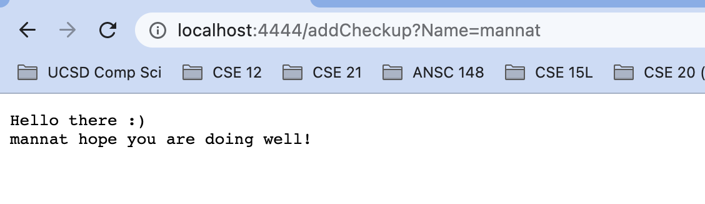

## Part 2: Bugs 

### 1. 

Linked List: Append Method
--------------------------
FAILURE INDUCING INPUT : A linked list with elements {2, 3, 4}

![Image]Lab_Report_2_Photos/LL_Append_FII.png)

SYMPTOM : 

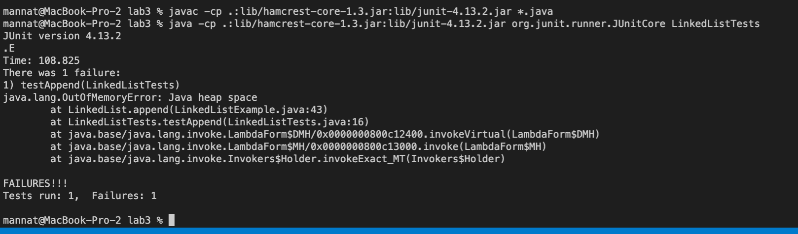

BUG : Moved  "n.next = new Node(value, null);" from inside the while loop to outside the while loop 

SYMPTOM & BUG CONNECTION: When you append a value, and neither the root nor the next node after the root is null, then it enters the while loop. However it produces an infinite while loop, because n.next was being set to a new Node inside rather than outside the loop. --> Resulted in an error of "Java heap space". 

CHANGED : Method after making change (shown below)

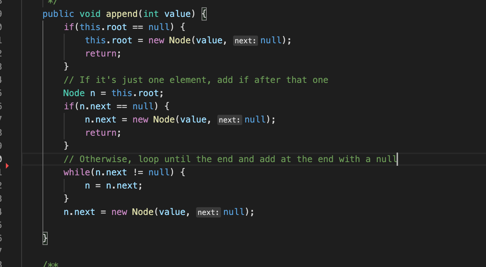

### 2. 

File: GetFiles Method
--------------------------

FAILURE INDUCING INPUT : A list of file paths and a folder path

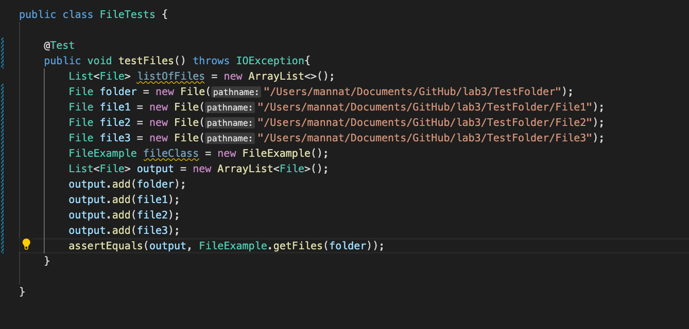
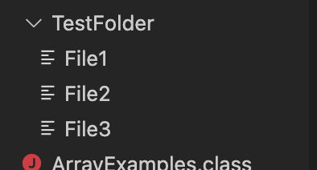

SYMPTOM : The expected order of the files in the list was different than the order of the files outputed by the method. 

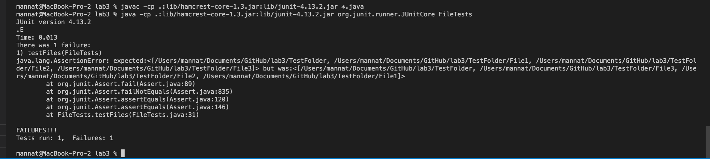

BUG : The method .listFiles() from the Files class.

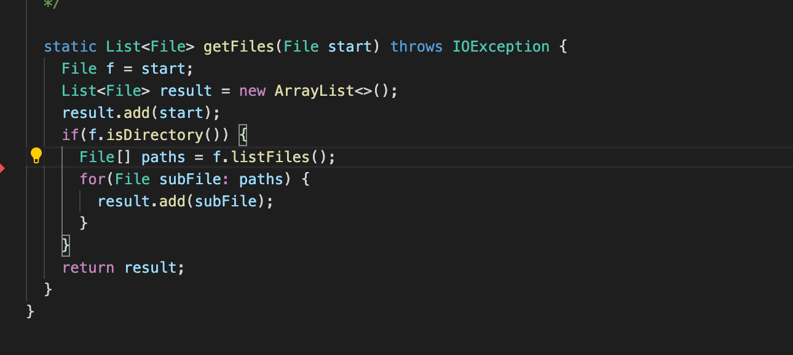

SYMPTOM & BUG CONNECTION: Since the method .listFiles() from the Files class does not put files in any particular order, when adding them to an array, our expected outcome is different. To fix this I used the .sort method from the Arrays class to order the files alphabetically after they have been added to the array

CHANGED : Method after making change

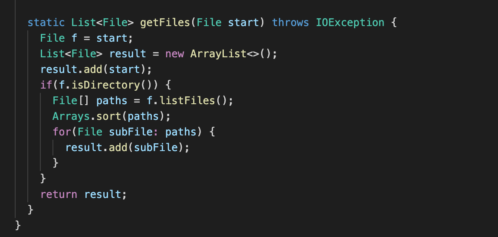

