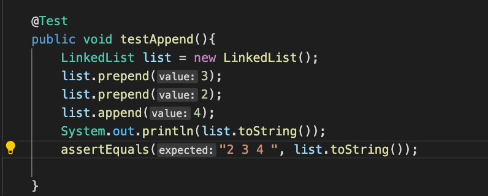
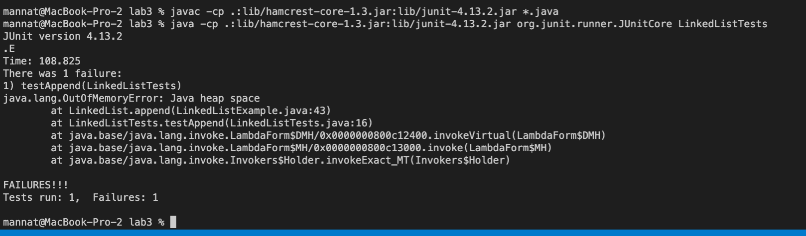
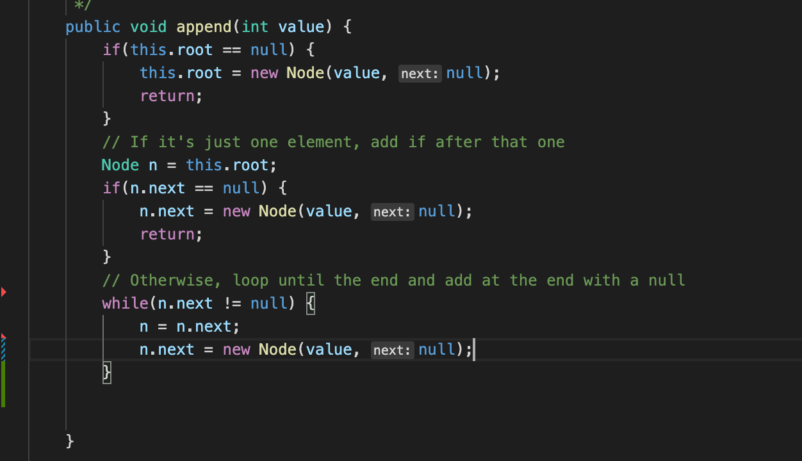
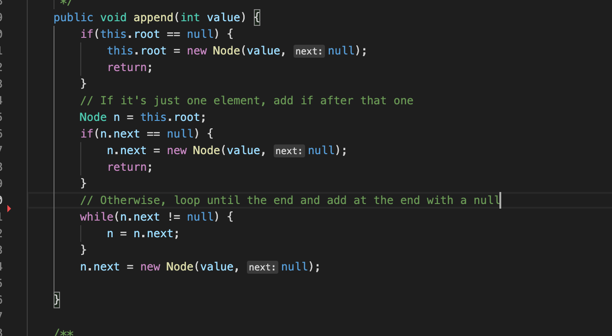
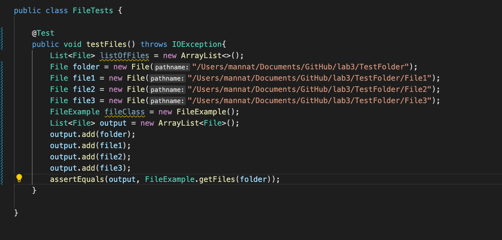
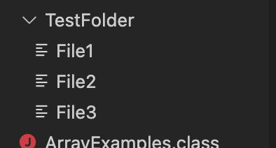
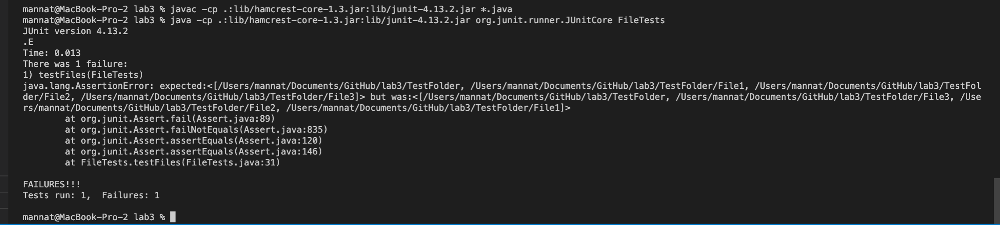
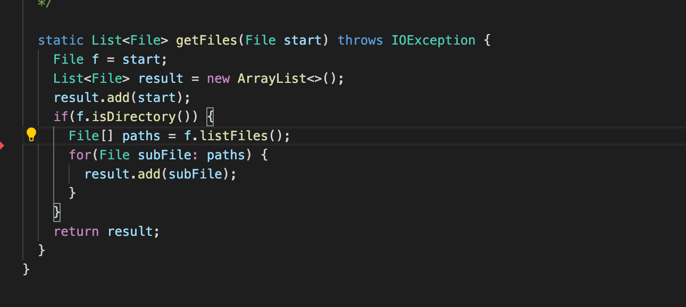

# **Welcome to my Lab Report 2 Page !**

# Lab 2 : Servers and Bugs 

## Part 1: Servers
## Part 2: Bugs 

>## 1. 
```
Linked List: Append Method
__________________________

FAILURE INDUCING INPUT : A linked list with elements {2, 3, 4}



SYMPTOM : A infinite while loop ran, because n.next was being set to a new Node instead rather than outside the loop. --> Resulted in an error of "Java heap space"



BUG : move  "n.next = new Node(value, null);" from in the while loop to outside the while loop 



CHANGED : method after making change



```
>## 2. 
```
Files: GetFiles Method
__________________________

FAILURE INDUCING INPUT : A list of files paths 





SYMPTOM :



BUG :



CHANGED : 


```