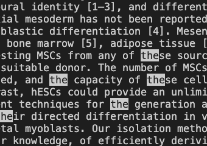
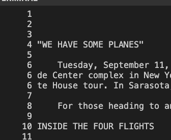
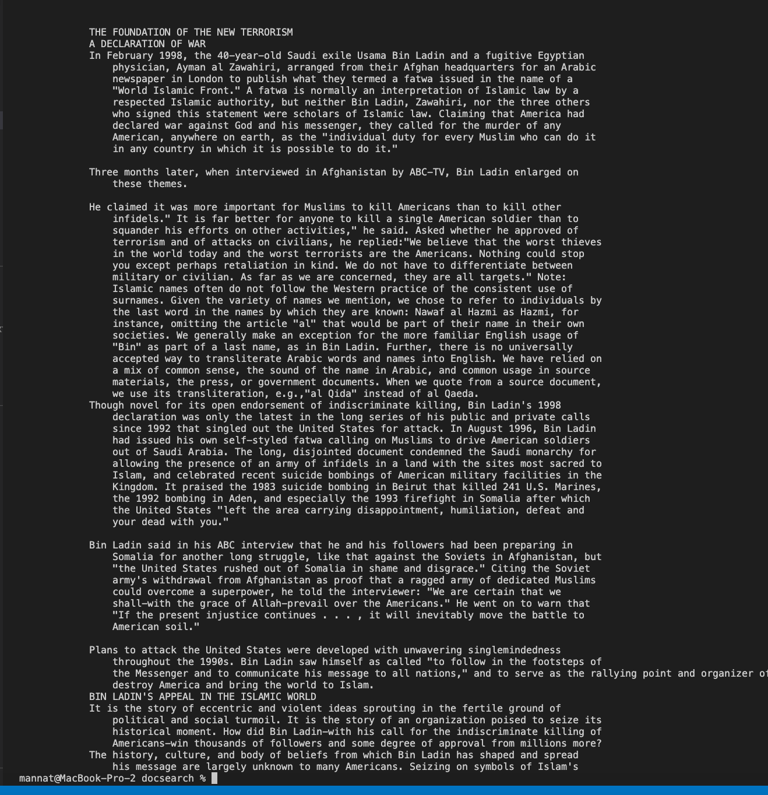
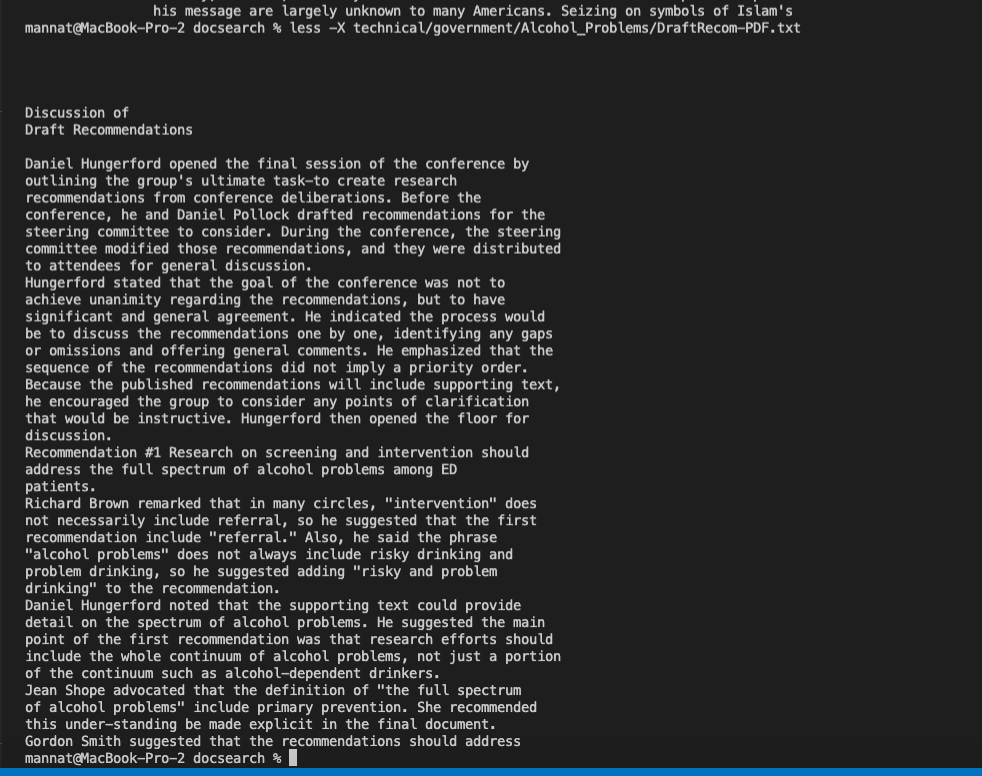
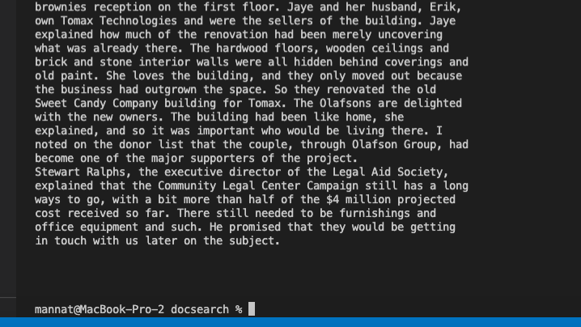

# **Welcome to my Lab Report 3 Page !**

# Week 5 Lab Report: The many fun ways to use 'find' 

## less -p[string] [file path]
-------------------------

This command highlights any occurence of the string you passed within the given file. It also directly goes to the first occurence of the string in the file. This is useful for when trying to find if a certain string exits in a file and where it is located, especially when trying to find the first occurence. 

### Example 1:

Input:
```
mannat@MacBook-Pro-2 docsearch % less -psystem technical/911report/chapter-1.txt
```
Output


In this case we see that we were searching for the substring "system". So it highlighted wherever it found "system" within the file. 

### Example 2:

Input:
```
mannat@MacBook-Pro-2 docsearch % less -pPurification technical/plos/pmed.0020161.txt
```

Output


In this example we were searching for "Purification" in this file. However it did not find any occurence of that string. In such cases we get the above output. Something to notice is that athough "Purification" wasn't found, "purififcation" is in the file. This just shows that it is case-sensitive.

### Example 3:

Input:
```
mannat@MacBook-Pro-2 docsearch % less -pthe technical/plos/pmed.0020161.txt
```

Output



Over here something noticable is that it finds ALL occurences of the string we are searching for, since "the" is highlighted multiple times. 

## less -N [file path]
-------------------------

The purpose of this command is to display the line numbers along with the contents of the file. 


### Example 1:

Input:
```
mannat@MacBook-Pro-2 docsearch % less -N technical/911report/chapter-1.txt   
```
Output




### Example 2:

Input:
```
mannat@MacBook-Pro-2 docsearch % less -N technical/biomed/1468-6708-3-7.txt

```

Output


### Example 3:

Input:
```
mannat@MacBook-Pro-2 docsearch % less -N technical/government/Alcohol_Problems/DraftRecom-PDF.txt
```

Output


 

## less -X [file path]
-------------------------

This commands leaves the contents of the file in the terminal after exiting. You can also use the down arrow to control how much of the should display after exiting. This is useful for when you need to reference back to something in the file when you are in the terminal. 


### Example 1:

Input:
```
mannat@MacBook-Pro-2 docsearch % less -X technical/911report/chapter-2.txt  
```
Output




### Example 2:

Input:
```
mannat@MacBook-Pro-2 docsearch % less -X technical/government/Alcohol_Problems/DraftRecom-PDF.txt

```

Output




### Example 3:

Input:
```
mannat@MacBook-Pro-2 docsearch % less -X technical/government/Media/5_Legal_Groups.txt
```

Output




 