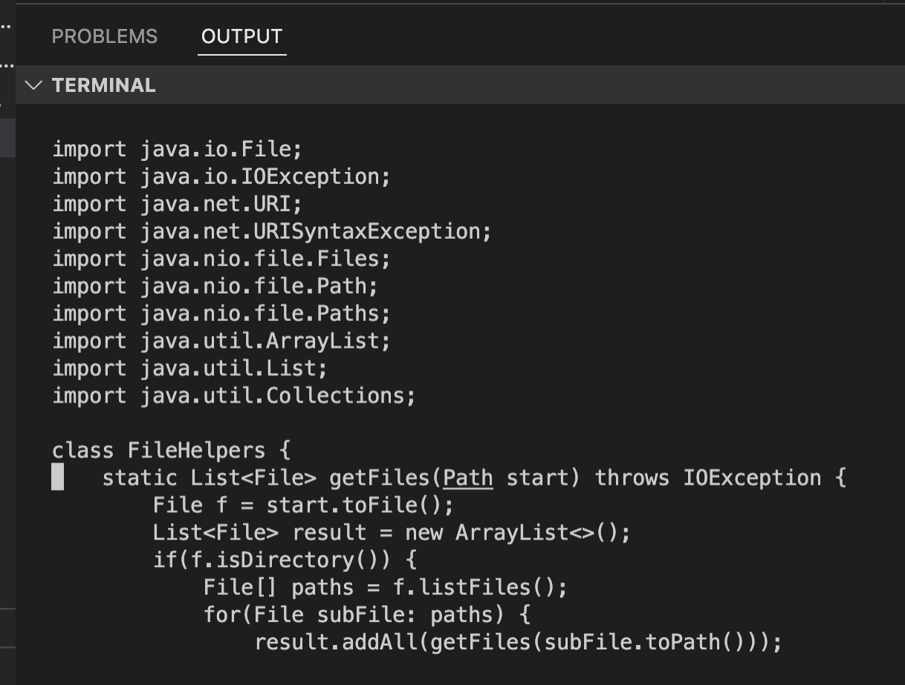
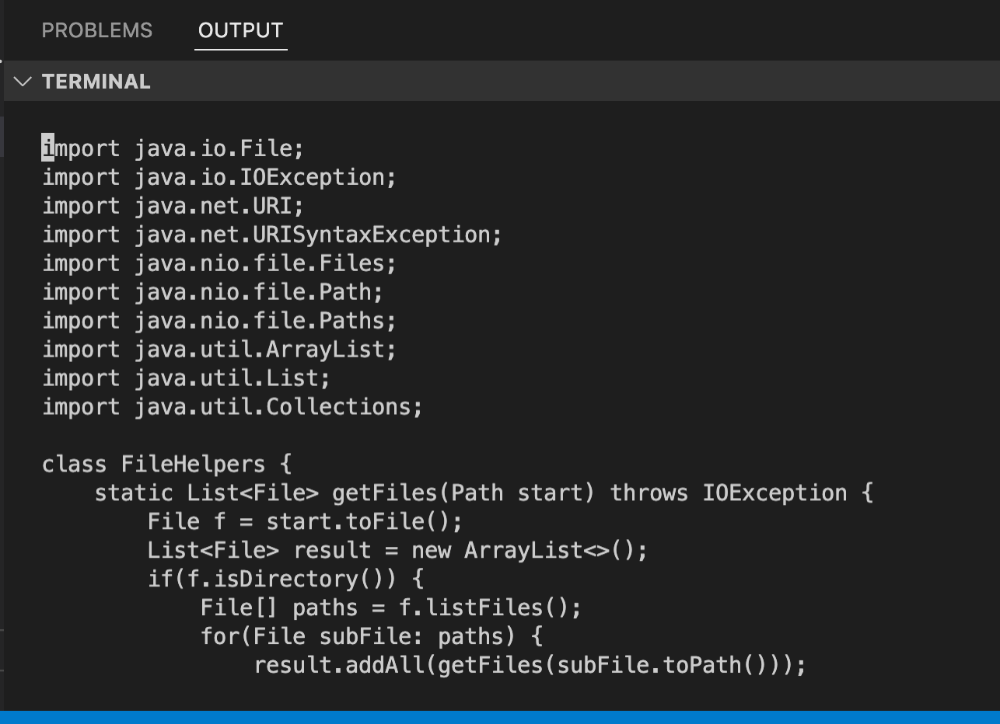
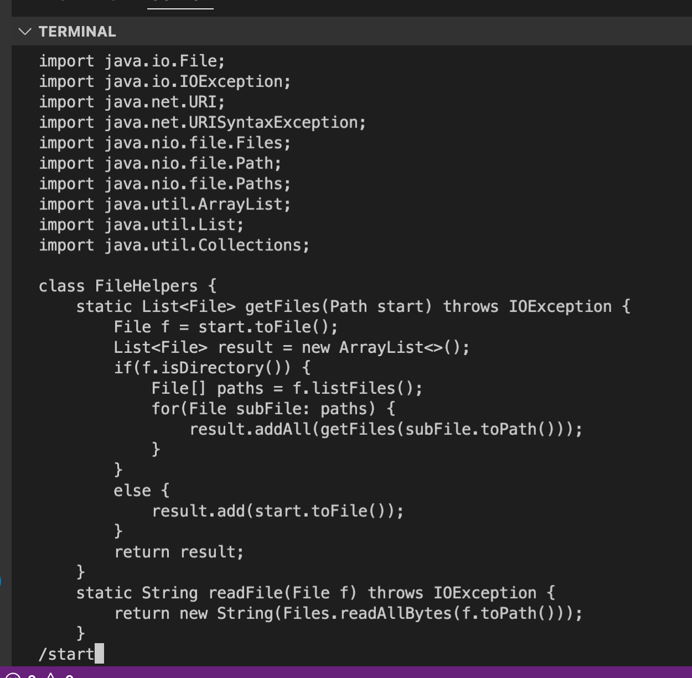
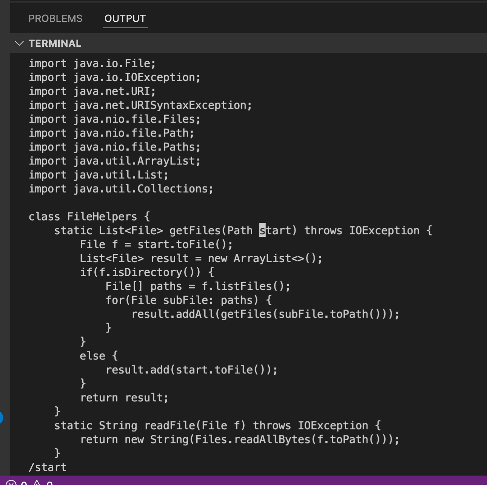
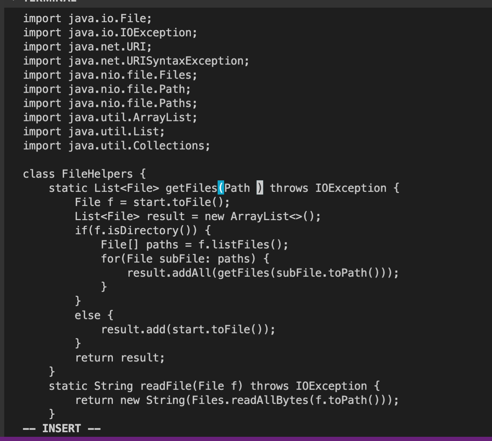
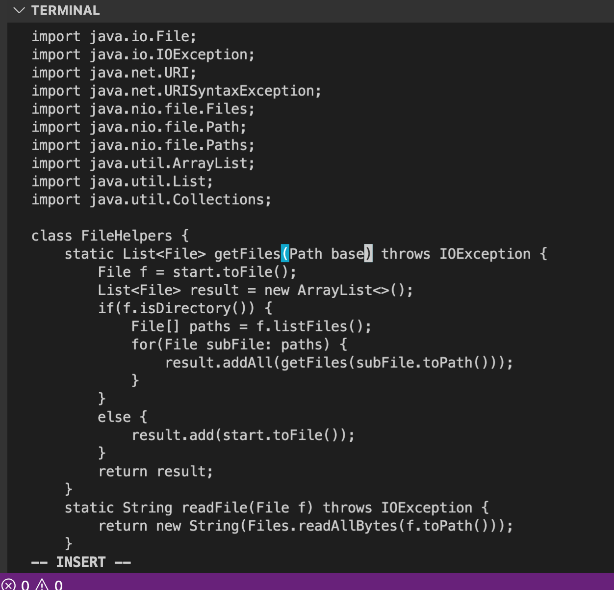
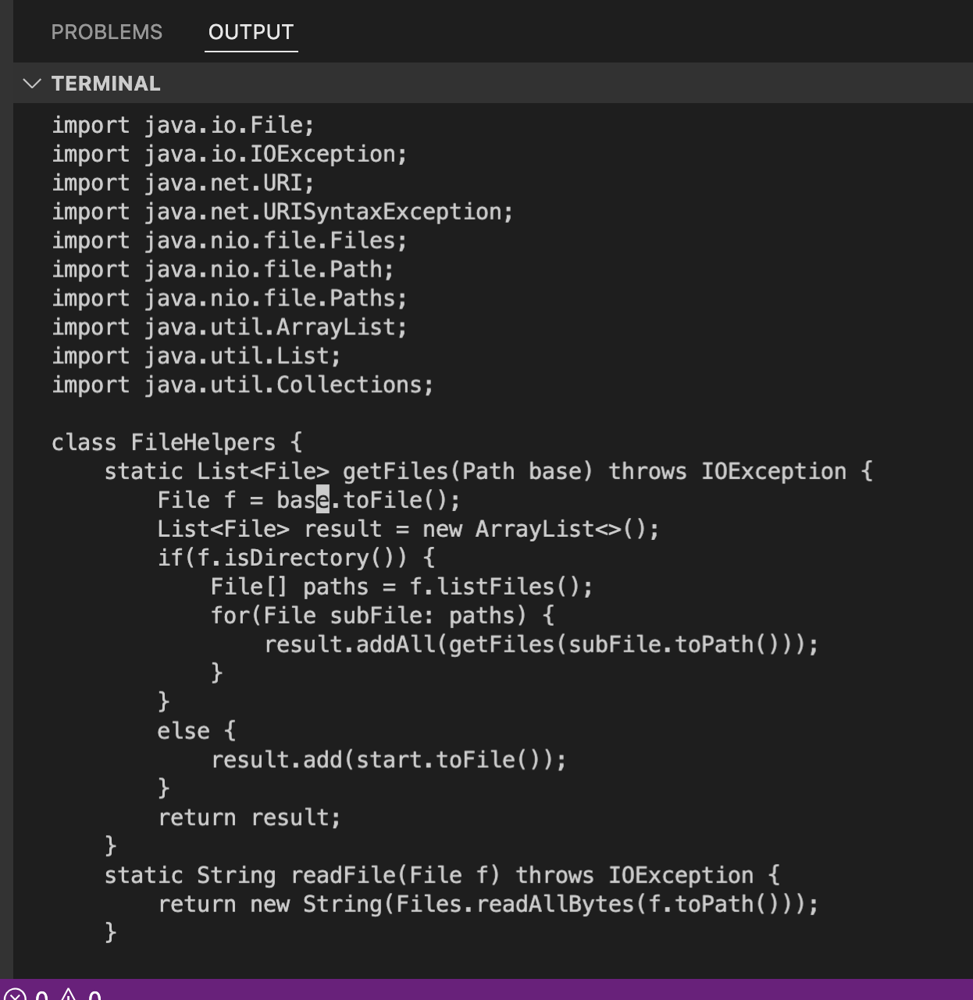
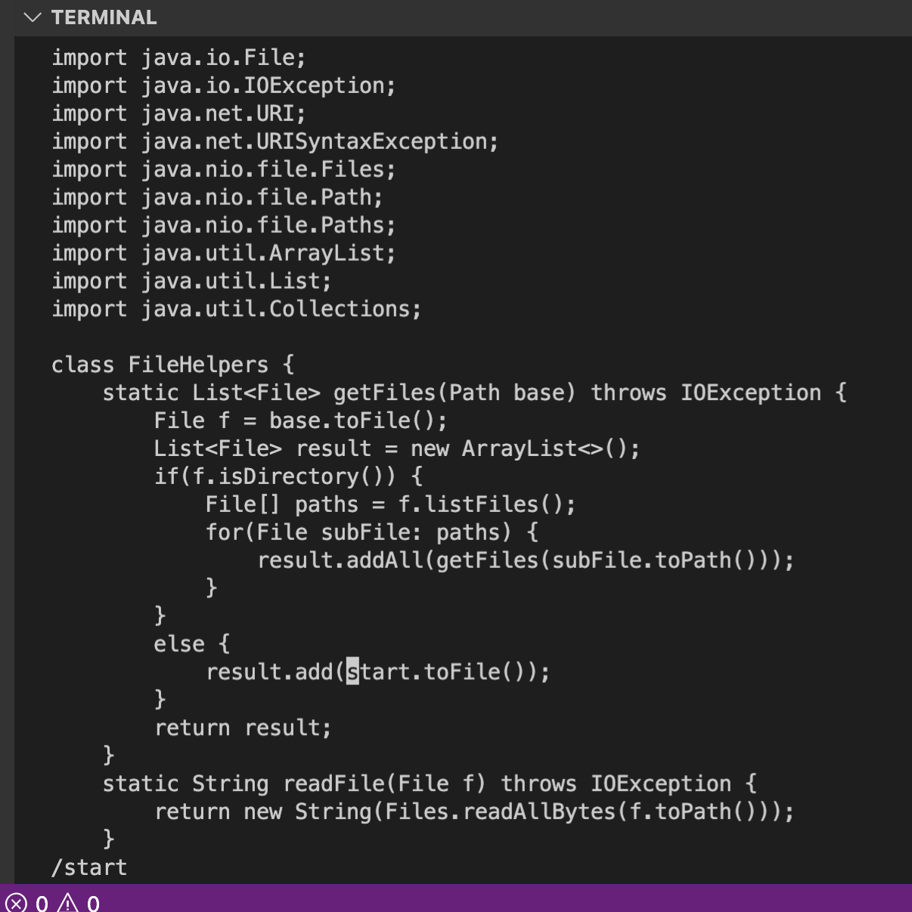
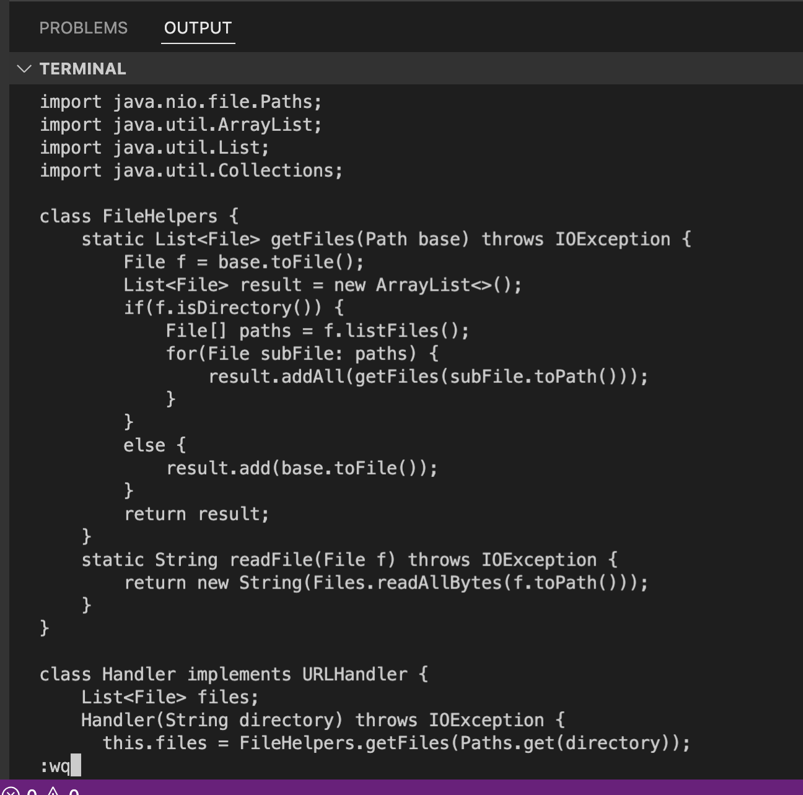
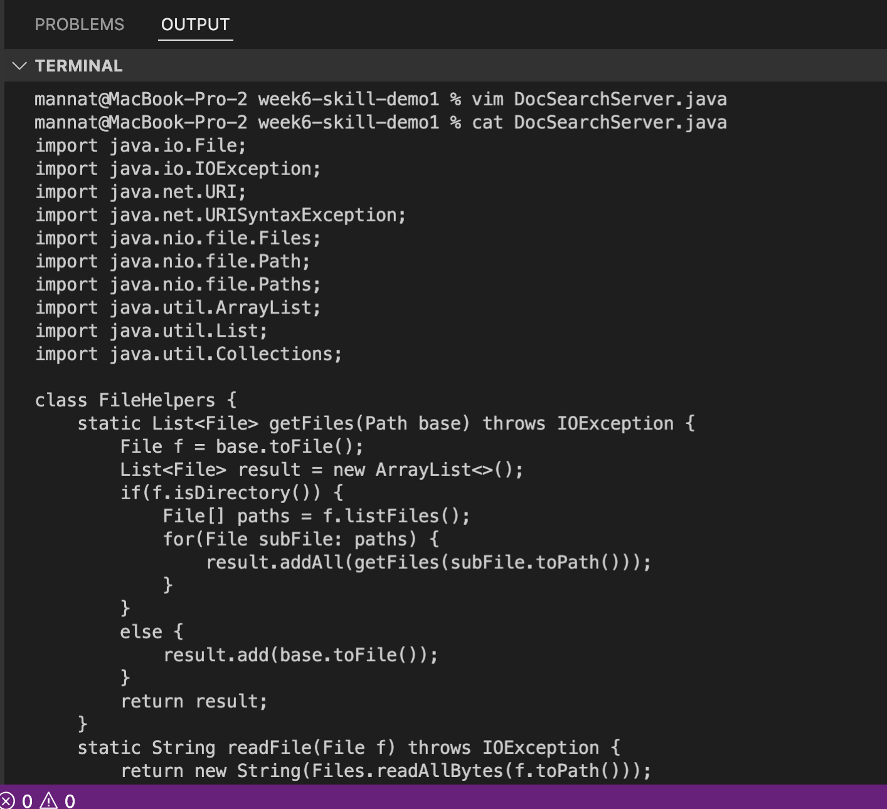

# **Welcome to my Lab Report 4 Page !**
# Week 7 Lab Report: Using Vim  

## Part 1: Shortest set of sequence of vim commands

The command I chose to focus on was changing the name of the "start" paramter and its uses to "base" in the getFiles method (the first task)

Sequence:gg /start \<Enter> ce base \<Escape> n.n. :wq \<Enter>

1. Enter "vim Doc" and then \<Tab> to get the terminal to fill in the name for you. Then hit \<Enter>
2. After entering the normal mode of "DocSearchServer.java" type in "gg" to go to the very beginning of the page  
Before: As you can see in the image below, sometimes the cursor is not at the very top of the file 

After: The image shows that after entering "gg" the cursor moved to the very beginning/top leftmost part of the file

3. Enter /start to go to the first occurence of start in the file
Before: The cursor is at the very beginning of the file and I have entered /start however have not hit \<Enter> yet 
 
After: After hitting \<Enter> the /start command takes into effect and moves the cursor to the first occurence of start in the file
 
4. Then entering ce will enter insert mode and delete the word. 

5. Then while in insert mode enter in base. 

6. Now you can exist insert mode by \<Esc>. As the image shoes, it no longer says "-- INSERT --", therefore I have successfully exited insert mode and entered normal mode.

7. By entering "n" we go to the next occurence of start in the file. 

8. In order to change "start" to "base" in few steps enter "." in normal mode. It will delete "start" and enter "base" in one command. 

9. to go to the last occurence of start. Repeat steps 7 and 8

10. Now to save all the changes enter "wq!". This will exist out of vim and go to the terminal. 

11. to check the results of out changes we can use the "cat" command to print the contents of the DocSearchServer.java file. 

## Part 2: Comparing Making Edits W/ and W/out Vim

Compare the time it takes to do the following similar tasks just using different methods. 

Task: Change start to base in the getFiles method on DocSearchServer.java and then copy the file to the remote server and test it with bash test.sh.

Task 2: On the remote server, use vim to make edits and then test the code using bash test.sh. 

Making edits without vim took me about 1 minute and 5 seconds, while making edits with vim took me about 40 seconds. 

This is taking into consideration that I had already git cloned all the necessary files on my local and remote server. I had all the commands ready and also had already fixed TestDocSearch.java. All I had to do was edit DocSearchServer.java and run bash test.sh 

Questions 

1. Which of these two styles would you prefer using if you had to work on a program that you were running remotely, and why? 
    
    Completing this task made me realize how useful and time efficient vim can be. Since I am still learning all the features of vim and familiarizing myself with them, I think I could cut down the time even further for task 2. Even without being completely comfortable with vim, it took me less time to do the task using that method. So I would probably prefer to use vim.
2. What about the project or task might factor into your decision one way or another? (If nothing would affect your decision, say so and why!)
     
    One thing which might influence my decision is if I am working with a file with a bunch of lines of code. I think for these situations vim would be the most useful for searching particular words, compared to just manually finding them. If the file is very short, then I might just make edits without vim, because it is pretty simple to do just by moving your mouse and not having to use keys j, h, k, l to move around the file. 

