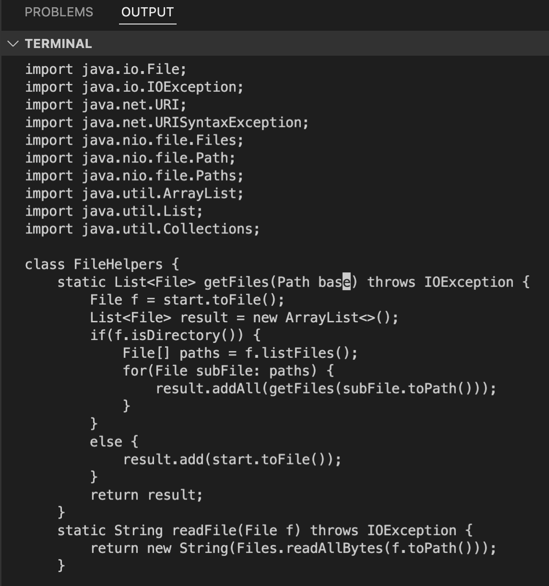
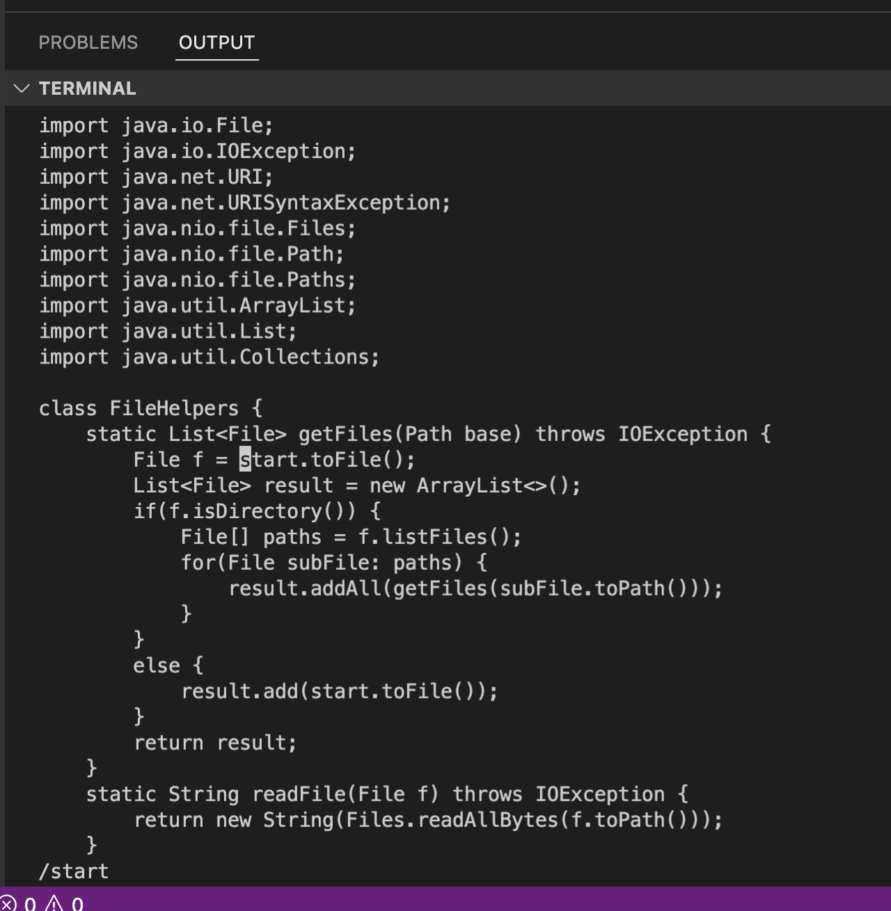

# **Welcome to my Lab Report 4 Page !**
# Week 7 Lab Report: Using Vim  

## Part 1: Shortest set of sequence of vim commands

The command I chose to focus on was changing the name of the "start" paramter and its uses to "base" in the getFiles method (the first task)

Sequence:gg/start<Enter>cebase<Escape>n.n.n.n:wq

1. Enter "vim Doc" and then <Tab> to get the terminal to fill in the name for you. Then hit <Enter>
2. After entering the normal mode of "DocSearchServer.java" type in "gg" to go to the very beginning of the page  

Before: As you can see in the image below, sometimes the cursor is not at the very top of the file 

After: The image shows that after entering "gg" the cursor moved to the very beginning/top leftmost part of the file

3.  Enter /start to go to the first occurence of start in the file

Before: The cursor is at the very beginning of the file and I have entered /start however have not hit <Enter> yet

After: After hitting <Enter> the /start command takes into effect and moves the cursor to the first occurence of start in the file

4. Then entering ce will enter insert mode and delete the word. 

5. Then while in insert mode enter in base. 

6. Now you can exist insert mode by <Esc>. As the image shoes, it no longer says "-- INSERT --", therefore I have successfully exited insert mode and entered normal mode.

7. By entering "n" we go to the next occurence of start in the file. 

8. In order to change "start" to "base" in few steps enter "." in normal mode. It will delete "start" and enter "base" in one command. 

9. to go to the last occurence of start. Repeat steps 7 and 8

10. Now to save all the changes enter "wq!". This will exist out of vim and go to the terminal. 

11. to check the results of out changes we can use the "cat" command to print the contents of the DocSearchServer.java file. 

