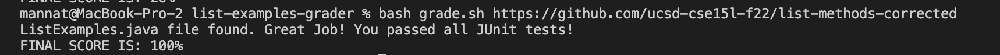
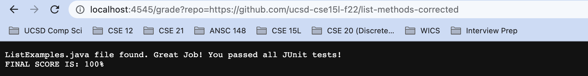
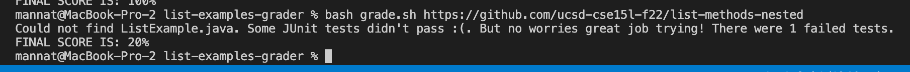
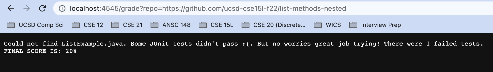
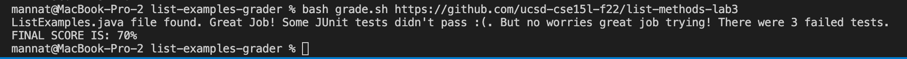
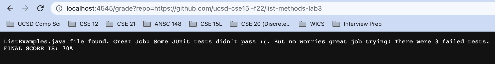

# **Welcome to my Lab Report 5 Page !**
# Week 9 Lab Report: Autograding Script 

Grade.sh (Bash Script)
--------------------------
>

    set -e 
    CP=".:lib/hamcrest-core-1.3.jar:lib/junit-4.13.2.jar"
    score=0
    PASSED="OK"
    FAILED="Failures"
    message=""

    rm -rf student-submission
    git clone $1 student-submission 2> clone.txt 
    cd student-submission/

    #checking if the file exists. If file exists then 10 points else 0 points 
    if ! [[ -f "ListExamples.java" ]] ; then 
        message+="Could not find ListExample.java."
    else 
        ((score = score + 10 )) 
        message+="ListExamples.java file found. Great Job!"
    fi

    # going into my doc and copying over TestListExamples.java 
    cd /Users/mannat/Documents/GitHub/list-examples-grader/
    cp TestListExamples.java student-submission 
    cp -r lib student-submission

    cd /Users/mannat/Documents/GitHub/list-examples-grader/student-submission/

    set +e

    #JUnit tests
    javac -cp $CP *.java 2> javacTest.txt
    java -cp $CP org.junit.runner.JUnitCore TestListExamples > javaTest.txt
    #successful running tests automatically get 40 points for 50% total 
    if [ $? -eq 0 ] ; then 
        ((score = score + 40 )) 
        message+=" You passed all JUnit tests!"
    else 
        message+=" Some JUnit tests didn't pass :(. But no worries great job trying!"
    fi

    grep . /Users/mannat/Documents/GitHub/list-examples-grader/student-submission/javaTest.txt > grepOutput.txt

    TAILOUT=$(tail -n 1 /Users/mannat/Documents/GitHub/list-examples-grader/student-submission/grepOutput.txt) 

    if [[ "$TAILOUT" == *"$PASSED"* ]]; then
    ((score = score + 50 ))
    fi

    #if it has failing test we will extract the number of failed tests 
    if [[ "$TAILOUT" == *"$FAILED"* ]]; then
    SUBSTR=$(echo $TAILOUT | cut -d' ' -f 5)
    fi

    FailedTEST=$((SUBSTR))

    #Point where at least getting JUnit tests to run 
    for (( i=0 ; i<$FailedTEST ; i++ )); 
    do 
        ((score = score + 20 ))
        #echo $i
    done

    #if any tests failed then add to message feedback 
    if [ $FailedTEST -gt 0 ]; then
        message+=" There were "$FailedTEST" failed tests."
    fi

    echo $message
    echo "FINAL SCORE IS: "$score"%"

## Outputs of Running Grade.sh on different Repositories

### Repository 1: list-methods-corrected

In terminal: 

In browser: 

### Repository 2: list-methods-nested

In terminal: 

In browser: 

### Repository 3: list-methods-lab3

In terminal: 

In browser: 

## Breakdown for Grade.sh on Repository 1 (list-methods-corrected)
* Line 1: This line is used to stop running the script when a non-zero error status is encountered. 
* Lines 2-7: Defines variables 
* Line 8: Deletes the directory "student-submission" if it exists
* Line 9: Copies the files from the repository we provide into student submission. It saves the standard error into clone.txt. 
    Standard Error Output: Cloning into 'student-submission'...
* Line 10: changes directory into student-submission
* Line 13: Checks to see if a file named "ListExamples.java" does not exist in the student-submission directory 
    Since in this repository a ListExamples.java files successfully copied over into the diretory, the else statement executes and lines 16 and 17 go into effect. 
* Lines 16-17: Incremenets the scores and adds to the message variable that the file was found. 
* Lines 21-25: Changes directory into list-examples-grader so it can copy over file TestListExamples.java and JUnit necessary files 
    into directory student-submission. 
    Then changes directory back into student-submission 
* Line 27: This line allows the script to keep running even if a non-zero error status is encountered. 
* Lines 30-31: Compiles the TestListExamples.java file. 
    It stores the error message from line 30 into javacTest.txt. This repository doesn't produce an error message so the file is empty. 
    It stores the standard output from from line 31 into javaTest.txt. In this case the message is 
>

    JUnit version 4.13.2
    ...
    Time: 0.007

    OK (3 tests)

* Line 33: Since the return code is 0, that means all the JUnit tests passed. The if statement executes and lines 34 and 35 run.  
* Lines 34-35: Increments the score by 40 and adds a String to the message variable which will let the user know all JUnit tests passed. 
* Lines 36-38: These lines don't execute because since the if statement went through the else statement commands don't run. 
* Line 40: Uses the grep command to take the contents in javaTest.txt and remove the empty lines, then save it into grepOutput.txt
* Line 42: Saves the last line from grepOutput.txt into the variable TAILOUT
* Lines 44-46: The if statement checks to see if TAILOUT is equal to the variable PASSED. 
    It basically checks to see if all the JUnit Tests passed. 
    In this case they did therefore, score is incremented by 50. 
* Lines 49-51: These do no execute in this case because TAILOUT equaled to PASSED and this statement is if some JUnit tests didnt pass. 
* Lines 53: In our case since Line 50 didn't execute, varaible SUBSTR just holds an empty string. 
    Therefore this line, which saves the int value of SUBSTR into FailedTest, just saves 0 for that variable. 
* Lines 56-60: This for loop does not execute because FailedTest equals 0. 
* Lines 63-65: Since FailedTest equals 0, the if statement commands don't run either. 
* Lines 67-68: The last 2 lines outputs the string stored in the variable message. 
    The String lets the user know some information about their java file, of what went right or wrong when running their file. 
    Then their final score is outputted, which in this case was 100%!

